## 第三方库移植示例
* 1.从Arduino的安装库的文件夹中找到要调用的第三方库
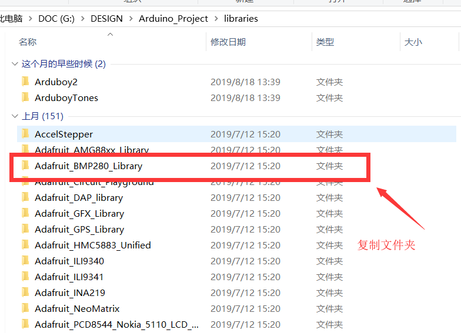

* 2.将刚才找到的第三方库放到Keil工程模板的Libraries文件夹内
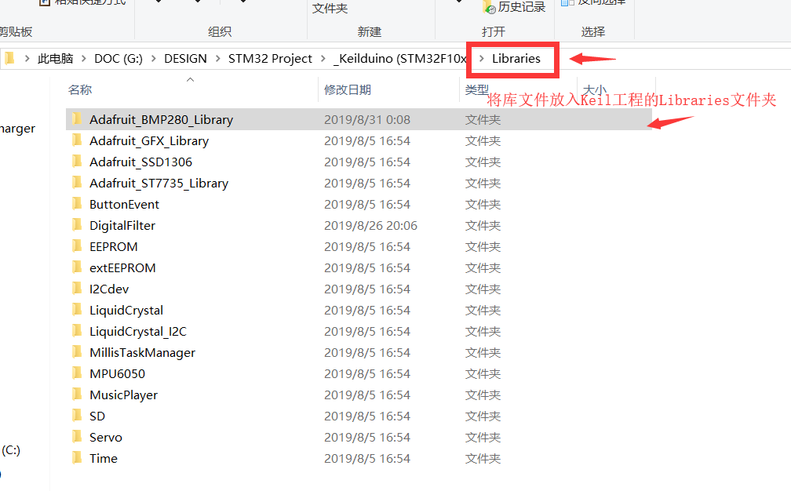

* 3.启动Keil工程
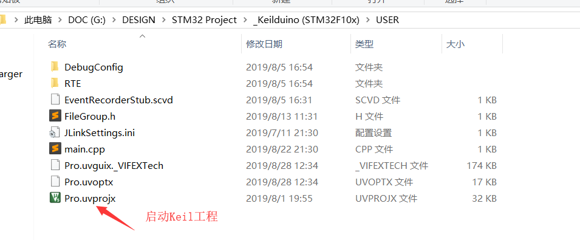

* 4.将第三方库的源代码文件添加到Keil的工程组
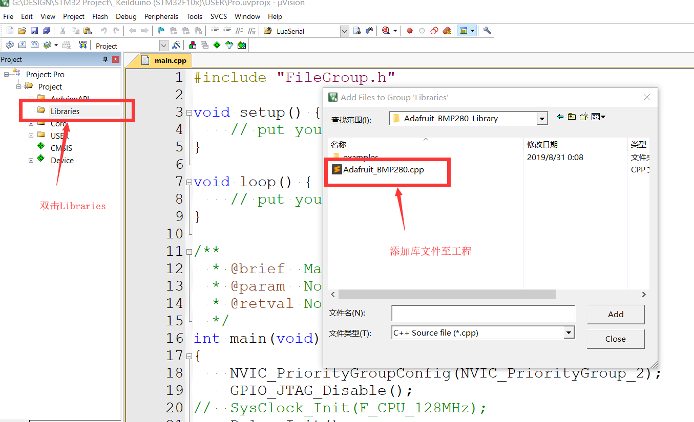

* 5.找到第三方库文件夹
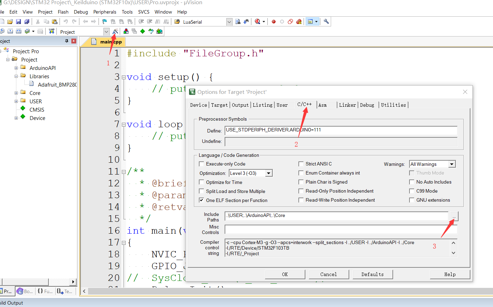

* 6.添加路径
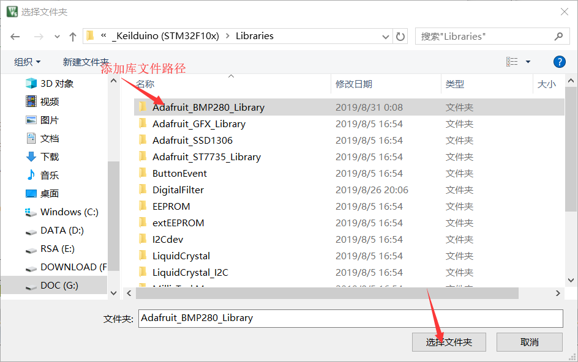

* 7.找到第三方库自带的示例程序(一般位于第三方库目录下的examples内)
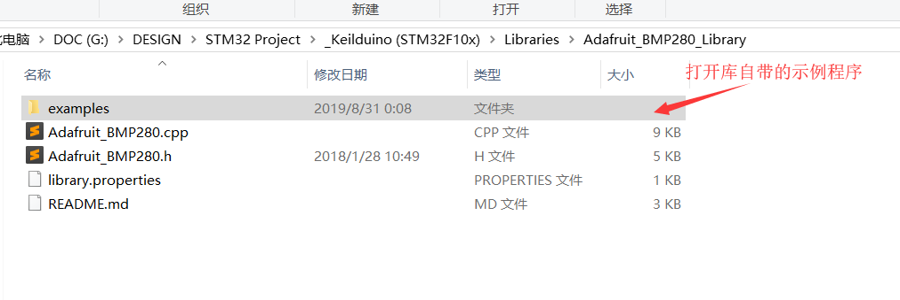

* 8.复制示例程序
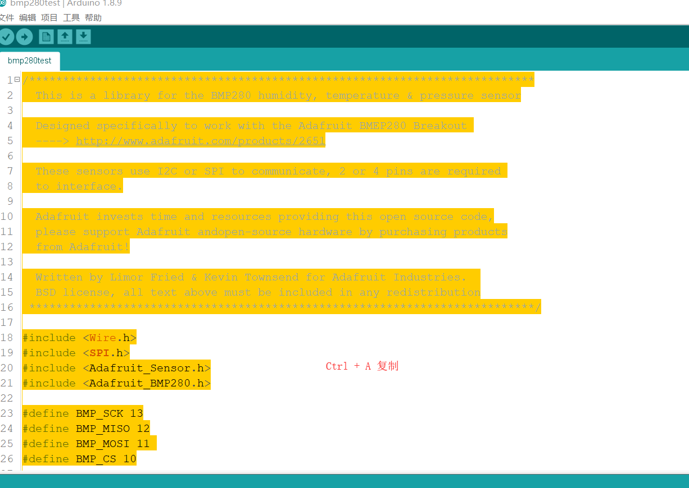

* 9.将示例程序复制到Keil工程模板的main.cpp里，替换 setup() 和 loop() 函数
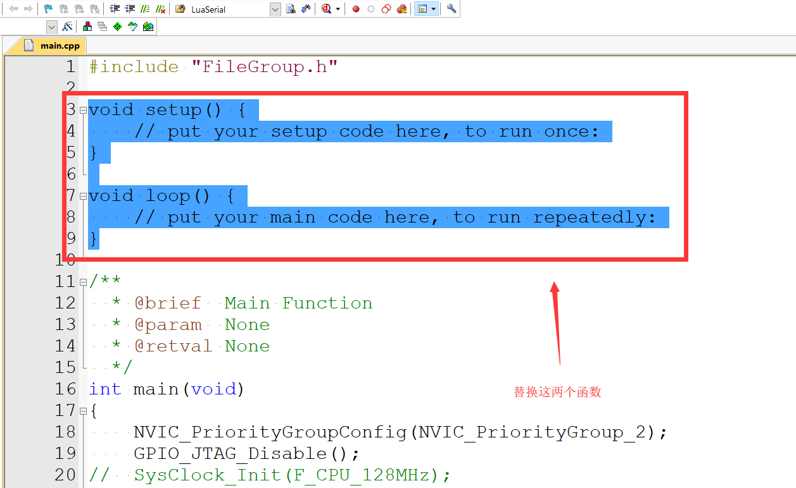

* 10.修改示例程序里的引脚定义为STM32的引脚
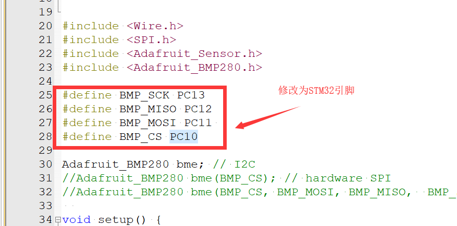

* 11.点击编译，如果编译无错误表示移植成功
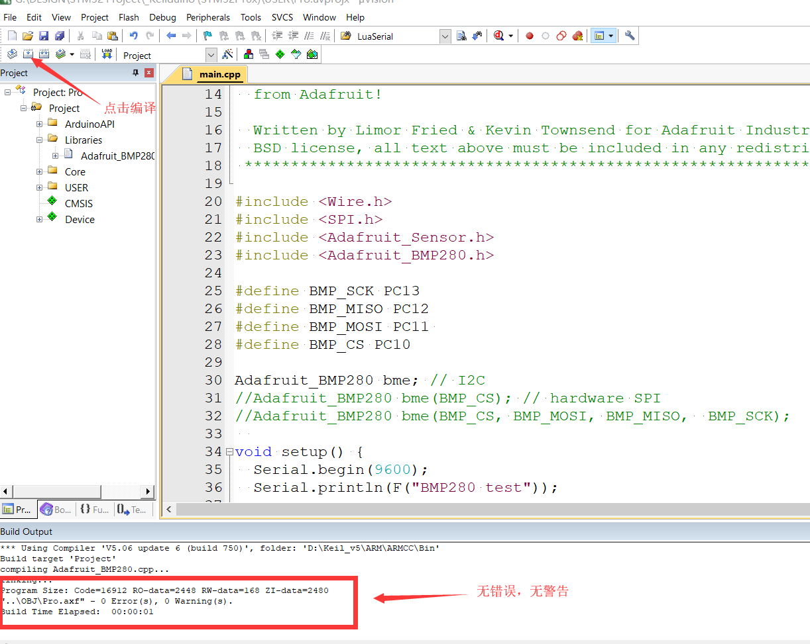
