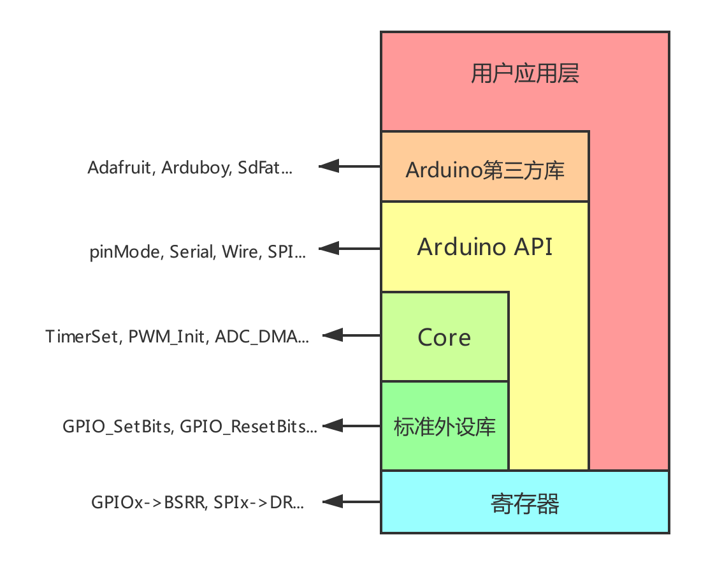

# Arduino for Keil

[](https://deepwiki.com/FASTSHIFT/Arduino-For-Keil)

## 1. 概述
Arduino for Keil 是 [Arduino](https://www.arduino.cc) 框架的一个轻量级实现，旨在使 [AT32](https://www.arterytek.com)/[STM32](https://www.st.com.cn) 系列单片机能够支持 [Arduino 语法](https://www.arduino.cc/reference/en)，并在 [Keil](https://www.keil.com) 环境中进行高效的编译与调试。

### 相对于传统开发方法的优势

1. **共享Arduino生态**：通过利用广泛的 Arduino 库资源（详见 [Arduino Libraries](https://github.com/topics/arduino-library)），降低了学习曲线，简化了开发流程。
2. **优化的硬件操控方式**：采用 **寄存器 + 宏** 的优化策略，减少了函数调用的开销，从而提升了程序的运行效率。
3. **精简的框架设计**：相较于 [stm32duino](https://github.com/stm32duino) 和 [HAL](https://github.com/STMicroelectronics/stm32f1xx-hal-driver/tree/master) 库，本项目拥有更小的代码体积和更快的编译与执行速度，实现了资源与性能的最佳平衡。

## 2. 使用方法
1. 安装对应平台的固件包（详见 [Packs](Packs)）。

**注意事项**：如果您已安装了更高版本的固件包，请使用 Keil 自带的包管理工具进行卸载（Remove）操作。

2. 打开 [Keilduino/Platform](Keilduino/Platform) 文件夹，选择对应的 MCU 型号。
3. 打开 MDK-ARM 文件夹内的 Keil 工程，进行开发:

> - 对于基本应用，用户可以直接参考 [Arduino 官方文档](https://www.arduino.cc/reference/en/)。
> - 对于更复杂的开发需求，可以参考 [Example](Example) 中的示例代码。
> - 第三方库的移植请参考 [Arduino 库移植指南](Arduino%20Library%20Porting%20Guide)。

### 灵活的开发模式
支持与寄存器和标准外设库函数的混合使用，**确保开发的灵活性**：
```C
void setup()
{
    pinMode(PA0, OUTPUT);                // 使用 Arduino 的 pinMode() 函数配置 PA0 为输出模式
}

void loop()
{
    GPIOA->BSRR = GPIO_Pin_0;           // 直接通过寄存器设置 PA0 电平拉高
    delay(1000);                        // 延时 1 秒
    GPIO_ResetBits(GPIOA, GPIO_Pin_0);  // 使用标准外设库的 GPIO_ResetBits() 函数将 PA0 电平拉低
    delay(1000);                        // 延时 1 秒
}
```

## 3.系统框架图


## 4.注意事项
 - 保留主函数：请勿删除 `main.cpp` 文件中的 `main` 函数。
 - 第三方库管理：在添加第三方库时，请确保提供完整的路径，并包含 `.cpp` 源文件。
 - 兼容性与调试：由于不同平台的差异性，部分函数库可能需要进行适当的修改以满足编译需求。具体修改方法可参考编译器错误提示，或在 [issues](https://github.com/FASTSHIFT/Arduino-For-Keil/issues) 中提交问题。
